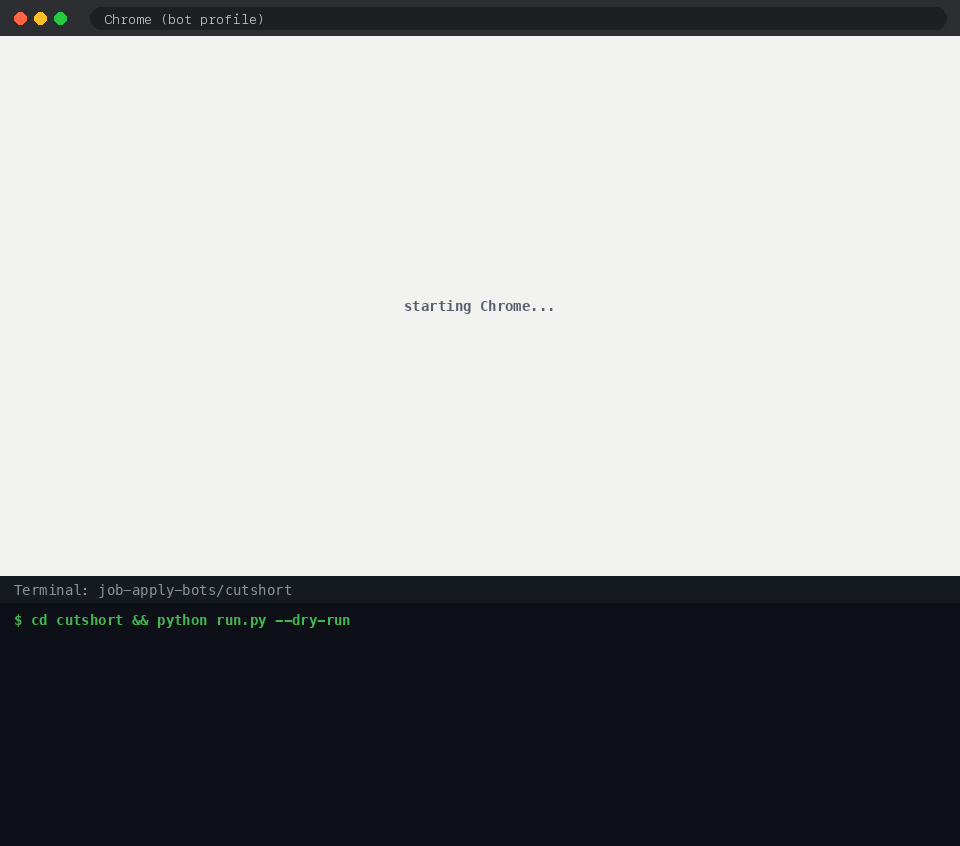
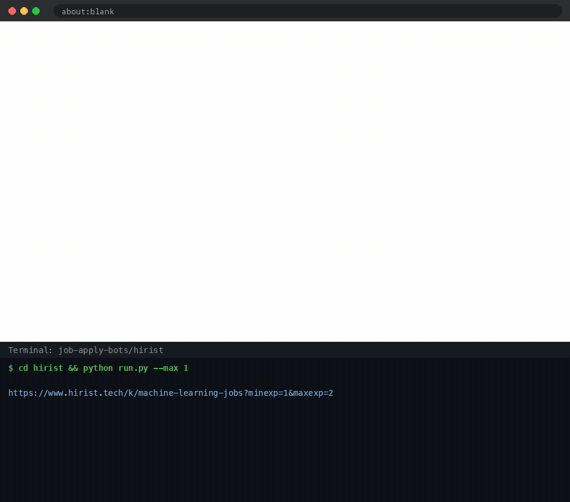

# job-apply-bots

Bots that apply to jobs for you on **Instahyre**, **Cutshort** and **Hirist**, three Indian tech job sites.
Each one opens a real Chrome window, searches with your filters (role, experience range), skips what doesn't fit,
answers the screening questions it has answers for, and applies. It never applies to the same job twice.

| Instahyre | Cutshort | Hirist |
|---|---|---|
|  |  |  |

<sub>Dry runs: the browser shows the site, the terminal shows the bot's decisions. Click a GIF to see it full size.</sub>

## What it handles

- **Filters:** title keywords to include/exclude, companies to skip, and an experience cap. Experience is read
  from the search results, so senior roles are skipped without even opening them.
- **Screening questions:** salary, notice period, "are you based in X?", relocation and similar, answered from
  your config. Anything it has no answer for is left for you (`needs_manual` + a screenshot), never guessed.
- **Logins:** Instahyre logs in with your email + password from `.env`. Cutshort and Hirist sign in with Google /
  OTP, which Google blocks in automated browsers, so the bot opens a *normal* Chrome window once for you to log
  in and reuses that session afterwards.
- **Safety:** daily and per-run caps, random pauses between applications, `--dry-run` and `--confirm` modes,
  and a history of every job it looked at.

## Setup

```bash
git clone <this repo> && cd job-apply-bots
python3 -m venv .venv
.venv/bin/pip install -r requirements.txt
.venv/bin/playwright install chromium   # only needed if you set browser_channel: ""

cp .env.example .env                     # Instahyre email + password
for bot in instahyre cutshort hirist; do cp $bot/config.example.yaml $bot/config.yaml; done
```

Edit each `config.yaml`: what to search for (`search.keywords` and your experience range), title filters and
your answers (salary, notice period, city). The bots build the search pages themselves.
Google Chrome must be installed (the bots drive it); macOS is what it's been tested on.

## Run

```bash
cd hirist                                # or instahyre / cutshort
../.venv/bin/python run.py --dry-run     # list what it would apply to
../.venv/bin/python run.py --confirm     # ask y/n before each application
../.venv/bin/python run.py               # apply
../.venv/bin/python run.py history       # what it did
```

| bot | finds jobs via | applies by | login |
|---|---|---|---|
| [instahyre](instahyre/README.md) | `skills=<keyword>&years=N` searches | job page "Apply now" | email + password from `.env` |
| [cutshort](cutshort/README.md) | logged-in job feed; keywords looked up as Cutshort skills | feed card "Apply now" → Send | by hand once (Google / OTP) |
| [hirist](hirist/README.md) | `/search/<keyword>?minexp=..&maxexp=..`, paged | job page "Apply" → screening questions | by hand once (OTP / password / Google) |

Each bot folder is self-contained: its own `config.yaml`, login session, history (`data/jobs.db`) and screenshots.

## Please use it responsibly

Automating applications may go against these sites' terms of service and can get an account restricted.
This is for personal use: keep the caps low, keep the filters tight, and only apply to jobs you'd actually take.
Recruiters read these applications.

## Credits

Built with [Claude Code](https://claude.com/claude-code), Anthropic's AI coding assistant. I set the direction,
tested every bot against the live sites and made the calls; Claude wrote most of the code and debugged each site's quirks.

## License

MIT
