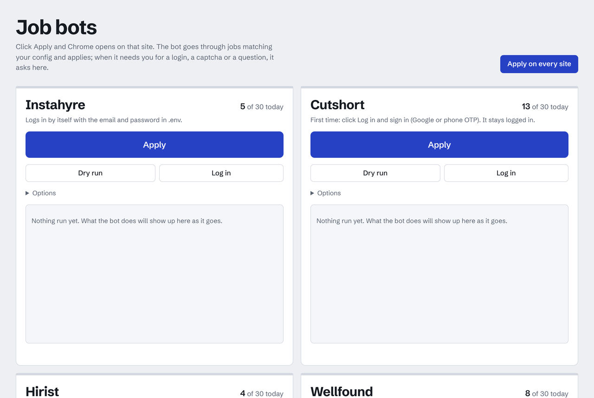

# job-apply-bots

Bots that apply to jobs for you on **Instahyre**, **Cutshort**, **Hirist**, **Wellfound** and **LinkedIn**.
Each one opens a real Chrome window, searches with your filters (role, experience range), skips what doesn't fit,
answers the screening questions it has answers for, and applies. It never applies to the same job twice.
The LinkedIn bot can also **ask for referrals**: it finds people at the companies you applied to among your
connections and messages them (or invites them first, and messages them once they accept).
Run them from a **browser dashboard** (one Apply button per site) or from the terminal.

| Instahyre | Cutshort | Hirist |
|---|---|---|
|  |  |  |

<sub>Dry runs: the browser shows the site, the terminal shows the bot's decisions. Click a GIF to see it full size.</sub>

## What it handles

- **Filters:** a title must match one of your topics (AI, ML, software development, SDE1/SDE2, ...) *and* be an
  actual engineering role (engineer, developer, scientist, SDE, ...), so "AI Trainer" or "Data Science SME" are
  skipped. Plus titles to exclude, companies to skip, and an experience cap; experience is read from the search
  results, so senior roles are skipped without even opening them.
- **Screening questions:** salary, notice period, "are you based in X?", relocation and similar, answered from
  your config. Anything it has no answer for is left for you (`needs_manual` + a screenshot), never guessed.
- **Logins:** Instahyre and Wellfound log in with your email + password from `.env`. Cutshort, Hirist and LinkedIn
  sign in with Google / OTP / security checks, which don't work in automated browsers, so the bot opens a *normal*
  Chrome window once for you to log in and reuses that session afterwards.
- **Safety:** daily and per-run caps, random pauses between applications, `--dry-run` and `--confirm` modes,
  and a history of every job it looked at.

## Setup

```bash
git clone <this repo> && cd job-apply-bots
python3 -m venv .venv
.venv/bin/pip install -r requirements.txt
.venv/bin/playwright install chromium   # only needed if you set browser_channel: ""

cp .env.example .env                     # Instahyre / Wellfound / LinkedIn email + password
for bot in instahyre cutshort hirist wellfound linkedin; do cp $bot/config.example.yaml $bot/config.yaml; done
```

Edit each `config.yaml`: what to search for (`search.keywords` and your experience range), title filters and
your answers (salary, notice period, city). The bots build the search pages themselves.
[What to change, and where](#what-to-change-and-where) lists every setting.
Google Chrome must be installed (the bots drive it); macOS is what it's been tested on.

## What to change, and where

Passwords go in `.env` in the repo root. Everything else is in each bot's own `<bot>/config.yaml` (`<bot>` is
`instahyre`, `cutshort`, `hirist`, `wellfound` or `linkedin`); the `config.example.yaml` next to it explains every
line. A change applies from the next run.

| To change | File | Setting |
|---|---|---|
| Login email and password | `.env` | `INSTAHYRE_…`, `WELLFOUND_…`, `LINKEDIN_…` (Cutshort and Hirist: click **Log in** once instead) |
| What to search for | `<bot>/config.yaml` | `search.keywords` |
| Your experience range | `<bot>/config.yaml` | `search.min_experience`, `search.max_experience` (Instahyre, Cutshort, Hirist) |
| Where | `<bot>/config.yaml` | `search.locations` (Wellfound, LinkedIn) |
| LinkedIn's own search filters | `linkedin/config.yaml` | `search.experience_levels`, `work_types`, `posted_within`, `easy_apply_only` |
| Which job titles to apply to | `<bot>/config.yaml` | `filters.include_title` (must have one), `filters.require_role` (must be an engineering role), `filters.exclude_title` |
| Companies to skip | `<bot>/config.yaml` | `filters.exclude_companies` |
| Most experience a job may ask for | `<bot>/config.yaml` | `filters.max_experience_required` |
| How many applications | `<bot>/config.yaml` | `limits.max_per_run`, `limits.max_per_day`, `limits.delay_seconds` |
| Answers to screening questions (salary, notice period, phone, city, college, yes/no questions) | `<bot>/config.yaml` | `answers`: a pattern of the question → your answer |
| LinkedIn's "years of experience with *X*?" | `linkedin/config.yaml` | `skill_years`, `other_skill_years` |
| Text for "message to the recruiter" / cover letter boxes | `<bot>/config.yaml` | `cover_note` |
| LinkedIn's "Follow *company*" tick | `linkedin/config.yaml` | `follow_companies` |
| Referral message and invite note | dashboard → LinkedIn card → **Referral message**, or `linkedin/config.yaml` | `referral.message`, `referral.connect_note` |
| Who gets asked for a referral | `linkedin/config.yaml` | `referral.school`, `referral.people_keywords`, `referral.skip_headline`, `referral.per_company` |
| How many referral asks | `linkedin/config.yaml` | `referral.max_per_day`, `referral.max_per_run` |
| Which jobs to ask about | `linkedin/config.yaml` | `referral.for_jobs`, `referral.within_days`, `referral.jobs` (extra LinkedIn job links) |

What the bots keep, in each bot's `data/` folder (never committed):

- `data/jobs.db`: every job it looked at and what happened; for LinkedIn also everyone asked for a referral.
- `data/screenshots/`: a screenshot of each job that needs you.
- `data/profile/`: the bot's own Chrome profile, with your login. Delete it to log out or switch accounts.

After changing filters, `run.py reset` makes a bot look again at the jobs it skipped before.

## Run

**From the browser (dashboard):** double-click `start-ui.command` in Finder (or run `.venv/bin/python ui/server.py`). A page
opens at `http://127.0.0.1:8765` with an **Apply** button per site, plus Dry run, Log in and Stop. You see what the
bot is doing as it goes, and when it needs you (a login, a captcha, "Apply to this one?", a question it can't
answer) the question shows up there with buttons to answer it. A History table below lists what it applied to and
what still needs you, with screenshots. The LinkedIn card also has **Ask for referrals** and a box to edit the referral
message, and a Referrals table lists who was asked. Keep the Terminal window it opens running while you use the page; closing
it stops the bots. **Apply on every site** runs all bots at once, each in its own Chrome window. The page is only
reachable from your own computer, and works on macOS and Linux.



**From the terminal:**

```bash
cd hirist                                # or instahyre / cutshort / wellfound / linkedin
../.venv/bin/python run.py --dry-run     # list what it would apply to
../.venv/bin/python run.py --confirm     # ask y/n before each application
../.venv/bin/python run.py               # apply
../.venv/bin/python run.py history       # what it did

cd ../linkedin
../.venv/bin/python run.py refer --dry-run   # who it would ask for a referral, and the message
../.venv/bin/python run.py refer --confirm   # ask, checking each message with you first
```

| bot | finds jobs via | applies by | login |
|---|---|---|---|
| [instahyre](instahyre/README.md) | `skills=<keyword>&years=N` searches | job page "Apply now" | email + password from `.env` |
| [cutshort](cutshort/README.md) | logged-in job feed; keywords looked up as Cutshort skills | feed card "Apply now" → Send | by hand once (Google / OTP) |
| [hirist](hirist/README.md) | `/search/<keyword>?minexp=..&maxexp=..`, paged | job page "Apply" → screening questions | by hand once (OTP / password / Google) |
| [wellfound](wellfound/README.md) | role pages `/role/l/<role>/<place>`, paged | job page "Apply Now" → dialog → Send | email + password from `.env` |
| [linkedin](linkedin/README.md) | `/jobs/search/?keywords=..&location=..`, Easy Apply only, paged | "Easy Apply" → each step of the dialog → Submit | by hand once |

Each bot folder is self-contained: its own `config.yaml`, login session, history (`data/jobs.db`) and screenshots.

## Please use it responsibly

Automating applications may go against these sites' terms of service and can get an account restricted.
This is for personal use: keep the caps low, keep the filters tight, and only apply to jobs you'd actually take.
Recruiters read these applications. LinkedIn is the strictest about automation and the account that matters most:
read [Be careful with your LinkedIn account](linkedin/README.md#be-careful-with-your-linkedin-account), and check
referral messages with `--confirm` (they go to real people, in your name).

## Credits

Built with [Claude Code](https://claude.com/claude-code), Anthropic's AI coding assistant. I set the direction,
tested every bot against the live sites and made the calls; Claude wrote most of the code and debugged each site's quirks.

## License

MIT
