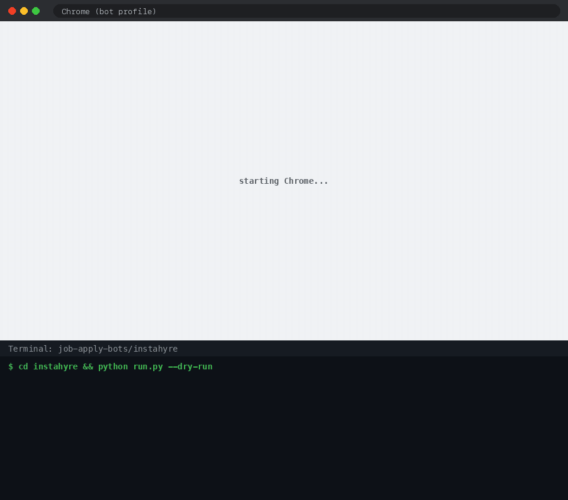

# Instahyre apply bot

Opens Chrome, logs in to Instahyre, goes through the search pages in `config.yaml`, and applies to jobs that match your filters.



```bash
cd instahyre
cp config.example.yaml config.yaml                # first time: then edit it
../.venv/bin/python run.py --dry-run             # see what it would apply to
../.venv/bin/python run.py --confirm --assist    # apply, asking before each one
../.venv/bin/python run.py                       # apply
../.venv/bin/python run.py history               # recent results
../.venv/bin/python run.py history --status needs_manual
../.venv/bin/python run.py reset                 # re-check filter-skipped jobs after changing filters
```

**Login:** saved session first; else `INSTAHYRE_EMAIL` / `INSTAHYRE_PASSWORD` from the `.env` file in the repo
root (copy `.env.example`); else it pauses so you can log in by hand. The session is kept in `data/profile/`.

**Where jobs come from:** list keywords (roles or skills) and your experience range under `search:` in
`config.yaml`. The bot searches each keyword for every year in the range (`skills=<keyword>&years=N`; Instahyre's
`years=N` means "minimum N years"), and checks each job page against `max_experience_required` as well.
Any URL in `search_urls` is used too.

**Results** are stored in `data/jobs.db`, so no job is applied to twice. `needs_manual` / `failed` jobs get a
screenshot in `data/screenshots/`. Failed jobs are retried next run.

| status | meaning |
|---|---|
| `applied` | applied and the page confirmed it ("Application sent!") |
| `already_applied` | applied before |
| `skipped` | didn't match filters, or you said no |
| `needs_manual` | questions with no answer in `config.yaml`, or no confirmation seen |
| `external` | apply goes to the company's own site |
| `failed` | page error; retried next run |

Only one run at a time: two runs can't share the same browser profile.
